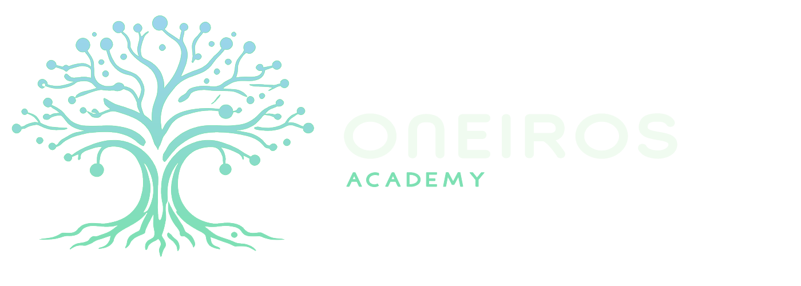

<p align="center">
  
</p>

<h1 align="center">Threat Modeling Lab</h1>

<p align="center">
  <em>Un laboratorio interactivo de 90 minutos para modelar amenazas combinando PASTA, OCTAVE, STRIDE y DREAD.</em>
</p>

<p align="center">
  
  
  
  
</p>

---

## ¿Qué es esto?

Un taller práctico de **Threat Modeling** para trabajar en grupo sobre un caso realista (la institución financiera ficticia *FinBank Digital*). Los participantes recorren, fase a fase, un flujo completo de modelado de amenazas: desde identificar los activos críticos hasta priorizar escenarios y defender una recomendación ejecutiva.

Todo está contenido en **un único archivo HTML** que funciona sin conexión, sin instalaciones y sin dependencias: solo se abre en el navegador.

## Los cuatro marcos, integrados

Los marcos no se usan en paralelo, sino en distintos momentos del flujo: se avanza de lo estratégico a lo técnico, y de lo técnico a la decisión.

| Marco | Pregunta que responde | Aporte en el taller |
|-------|----------------------|---------------------|
| **OCTAVE** | ¿Qué proteger? | Identifica activos críticos según su impacto en el negocio. |
| **PASTA** | ¿Quién y por qué? | Conecta los objetivos del negocio con motivaciones y rutas del adversario. |
| **STRIDE** | ¿Cómo, técnicamente? | Clasifica las amenazas concretas en 6 categorías. |
| **DREAD** | ¿Qué atender primero? | Prioriza los escenarios con un modelo de scoring transparente. |

## Características

- **Navegación por fases** con botones *Siguiente / Atrás*, barra de progreso y atajos de teclado (`←` / `→`).
- **Cronómetro por fase** que carga automáticamente el tiempo sugerido; el facilitador lo inicia, pausa o reinicia.
- **Hojas de trabajo editables** en cada paso: los grupos escriben directamente en el navegador.
- **Calculadora DREAD interactiva**: suma los puntajes automáticamente y resalta el escenario líder.
- **Registro de integrantes** al inicio (nombre, apellido y rol asumido).
- **Exportación a PDF** (botón *Imprimir*) que muestra el contenido completo de cada campo.
- **Identidad visual de Oneiros Academy** y diseño responsive.

## Cómo usarlo

> ℹ️ **Importante:** la vista normal del archivo en GitHub muestra el *código fuente*, no el taller. Para abrir el laboratorio usa una de estas opciones.

### Opción A — Descargar y abrir (recomendada para alumnos)

1. Abre el archivo y haz clic en **Download raw file**, o descarga directamente desde:
   `https://github.com/InstitutoCiberinteligencia/Threat-Modeling/raw/refs/heads/main/Threat-Modeling.html`
2. Haz doble clic en el archivo descargado: se abre en tu navegador.
3. ¡Listo! No requiere internet ni instalación.

### Opción B — Abrir directo en el navegador (GitHub Pages)

Activa **GitHub Pages** en el repositorio (*Settings → Pages → Build and deployment → Source: Deploy from a branch → Branch: `main` / `/ (root)`*). En un par de minutos el taller queda disponible en:

```
https://institutociberinteligencia.github.io/Threat-Modeling/Threat-Modeling.html
```

Así los alumnos solo abren el enlace, sin descargar nada. Es la opción más cómoda para repartir en clase.

## Flujo del taller (7 fases · 90 min)

| # | Fase | Tiempo | Marco | Resultado |
|---|------|:------:|-------|-----------|
| 1 | Inicio | 10 min | Contexto | Objetivos y marcos |
| 2 | El caso e integrantes | 8 min | Contexto | Comprensión común y roles |
| 3 | Activos críticos | 20 min | OCTAVE / PASTA | 3 activos priorizados |
| 4 | Escenarios | 15 min | PASTA / OCTAVE | 2 escenarios relevantes |
| 5 | STRIDE | 20 min | STRIDE | Amenazas por categoría |
| 6 | DREAD | 15 min | DREAD | Ranking de escenarios |
| 7 | Cierre | 12 min | Discusión | Escenario prioritario defendido |

## Guía rápida para el facilitador

- Proyecta el archivo y avanza en conjunto fase por fase.
- Forma grupos de **4 a 6 personas** y asigna los roles al inicio (Dirección/CISO, Analista CTI, SOC/Blue Team, Red Team, Riesgo/Legal, Relator).
- Usa el **cronómetro** para mantener el ritmo; cada grupo trabaja sus propias hojas.
- En el cierre, cada grupo presenta su escenario prioritario en **2 minutos**.
- Recuerda el sesgo de DREAD: el mayor puntaje no siempre es el mayor riesgo de negocio; eso da buena discusión.

> ⚠️ **Importante:** el contenido que se escribe vive solo durante la sesión del navegador (no se guarda al recargar). Si un grupo necesita conservar su trabajo, debe **exportar a PDF** antes de cerrar la pestaña.

## Estructura del repositorio

```
.
├── Threat-Modeling.html      # El laboratorio (todo en un archivo)
├── assets/
│   └── Oneiros-light-horizontal.png   # Logo para este README (opcional)
└── README.md
```

## Créditos

Desarrollado para **Oneiros Academy** como material de formación en ciberseguridad e inteligencia de amenazas.

---

<p align="center"><sub>Oneiros Academy · Threat Modeling Lab</sub></p>
